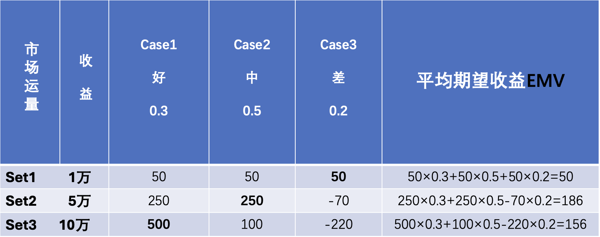
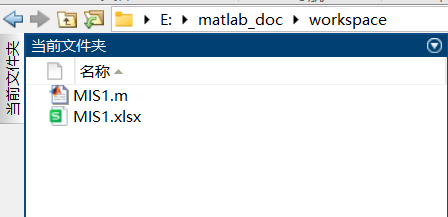
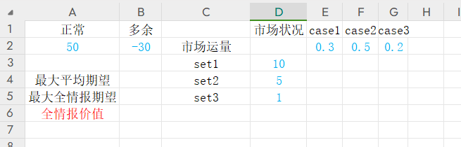
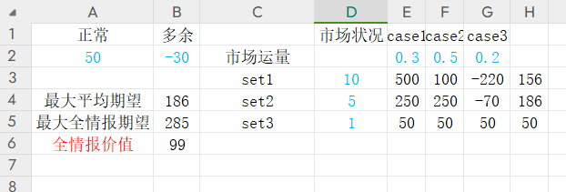
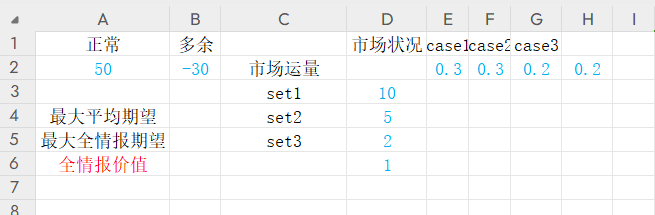
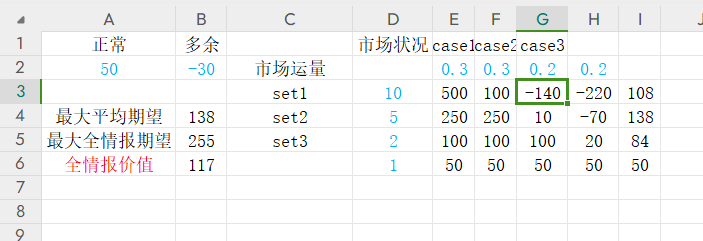

# 作业一

## 小组情况

组号：第三小组

| 姓名 |  王翼翔  | 谭涵 |  伍洛欧  |   吴樱   | 杨宇轩 |  张蕴泽  |  李可馨  |
| :--: | :------: | :--: | :------: | :------: | :----: | :------: | :------: |
| 学号 | 20200581 |      | 20215847 | 20211976 |        | 20210796 | 20205545 |

> 淘宝“女王节”，某电商计划同往年一样销售某品牌的化妆品。依据往年实际销量情况，若销路好，可按预期价格卖出10万套；若销路一般，尚可卖出5万套；但若销路差，则只能卖出1万套了。已知正常情况下每卖出一套可赚50元，但如果进货过量，则多余部分只好降价转手处理，每套反而要亏损30元。以往销路情况统计概率为：好为30%，中为50%，差为20%。为了获得最大利润，公司准备花钱先进行一下市场调查，以便尽可能摸清市场行情按需组织货源，那么问题来了：最多花费多少是值得的？

## 通常解

若不进行调查：

显然，进 5w 套期望利润最高，为 186 万元。

三种市场条件下，最高的利润分别为 $500\quad 250\quad 50$ 万元

在全情报的情况下，最高期望为 $500\times 0.3 + 250\times 0.5+50\times 0.2 = 285$ 万元

因此，认为最高花费 $285 - 186 = 99$ 万元是值得的

## 程序解

为了快速便利地解出此类问题，可以利用程序将其自动化。

此程序使用matlab脚本对excel表格进行自动读写，简单直观，**同时可以处理有大于三种市场状况的问题**，有不错的泛用性,应对更复杂的市场情况。

对于此题，仅需在excel表格中修改蓝色字体的参数，它们分别是，正常卖出和降价转手的盈利值、不同市场状况对应的销量和概率，修改好参数后保存表格并关闭，运行matlab脚本（注意matlab工作路径要与表格的位置相同），再次打开表格即可看到结果。

结果包括，九种进货量和市场状态对应的收益值、三种进货量的平均期望收益（最右列）、最大平均期望、最大全情报期望和全情报价值。

为了验证脚本的泛用性，改变题目，使其拥有四种市场情况：

结果如下：

脚本文件[MIS1.m](matlab/MIS1.m)与表格模板[MIS1.xlsx](matlab/MIS1.xlsx)见源文件（https://github.com/kingwingfly/MIS_cqu/blob/dev/matlab/MIS1.m）。

## 评价

> 该题假设市场的需求是离散的，即只有10w、5w、1w这几个值。这种假设不符合实际，使得最终的结论不具有足够的参考意义。——王翼翔

> 此题只考虑了与三种市场需求对应的进货量，有一定局限性，选择与市场需求不同的进货量是否能有更高的收益值得我们继续探究。——杨宇轩

## 总体评价：

该电商计划面临的是一个典型的风险管理问题，涉及市场需求的不确定性以及相应的进货和定价策略。其根据历史数据给出了三种可能的销售情况及其概率，这是基于概率的决策分析情况，考虑了不确定性。但需要注意历史数据可能不足以完全预测未来市场情况，还应考虑每增加一套商品的边际成本和边际效益，因为降价处理导致的亏损在进货量达到一定水平后，边际效益可能会下降。
首先可以准备多元化的销售策略，除了降价处理外，促销，捆绑销售等也有利于减少库存带来的损失。其次投资更高级的数据分析工具和技术，持续监控与评估市场需求，将市场调查、销售数据、库存管理等多个信息系统集成起来，实现数据的实时更新和共享，有助于快速响应市场变化，调整进货和定价策略。另外加强库存管理，避免库存积压和浪费。通过优化库存周转率和降低库存成本，可以提高整体利润水平。最后还可增加其他风险管理措施，比如与供应商建立长期合作关系，签订更灵活的合同以确保供应链的稳定性，减少不确定性带来的风险。
综上所述，该方案在一定程度上是合理的，因为它考虑了市场需求的不确定性和相应的风险。然而，通过加强数据收集和分析、灵活调整进货策略以及优化库存管理等方面的改进，可以进一步提高方案的合理性和实际效果。

## 分工

|    分工    |      人员      | 贡献权重 |
| :--------: | :------------: | :------: |
|   通常解   |     王翼翔     |   0.2    |
| 通常解图表 |      谭涵      |   0.2    |
|   程序解   |     杨宇轩     |   0.4    |
|    短评    | 王翼翔、杨宇轩 |    0     |
|  综合评价  |      吴樱      |   0.2    |

由于此课程最终小组得分由组员“瓜分”，因此需记取贡献权重。

记第 n 次作业权重为 $W_n$

记某人在第 n 次作业中的贡献权重为 $C_n$

$$
某人得分 = \frac {本组得分} {\sum_1^N {Wn}} \cdot \sum_1^N {( W_n\cdot C_n)}
$$

由于作业一工作较为简单，记本次作业权重为$1$，其余组员将在下次担任主力。
