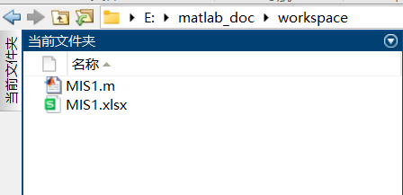
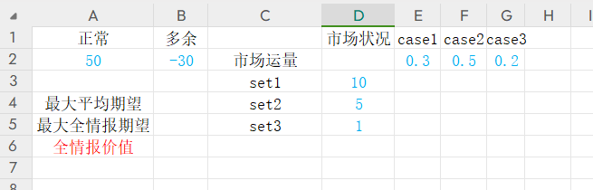
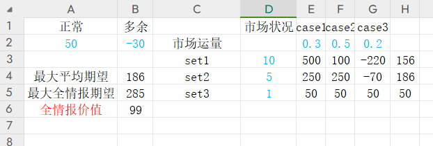
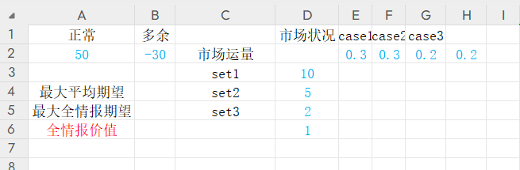
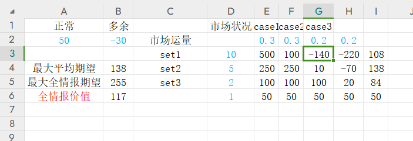

# 第一次作业

> 淘宝“女王节”，某电商计划同往年一样销售某品牌的化妆品。依据往年实际销量情况，若销路好，可按预期价格卖出10万套；若销路一般，尚可卖出5万套；但若销路差，则只能卖出1万套了。已知正常情况下每卖出一套可赚50元，但如果进货过量，则多余部分只好降价转手处理，每套反而要亏损30元。以往销路情况统计概率为：好为30%，中为50%，差为20%。为了获得最大利润，公司准备花钱先进行一下市场调查，以便尽可能摸清市场行情按需组织货源，那么问题来了：最多花费多少是值得的？

**通常解：**

若不进行调查：

显然，进 5w 套期望利润最高，为 186 万元。

三种市场条件下，最高的利润分别为 $500\quad 250\quad 50$ 万元

在全情报的情况下，最高期望为 $500\times 0.3 + 250\times 0.5+50\times 0.2 = 285$ 万元

因此，认为最高花费 $285 - 186 = 99$ 万元是值得的

**程序解：**

为了快速便利地解出此类问题，可以利用程序将其自动化。

此程序使用matlab脚本对excel表格进行自动读写，简单直观，**同时可以处理有大于三种市场状况的问题**，有不错的泛用性,应对更复杂的市场情况。

对于此题，仅需在excel表格中修改蓝色字体的参数，它们分别是，正常卖出和降价转手的盈利值、不同市场状况对应的销量和概率，修改好参数后保存表格并关闭，运行matlab脚本（注意matlab工作路径要与表格的位置相同），再次打开表格即可看到结果。

结果包括，九种进货量和市场状态对应的收益值、三种进货量的平均期望收益（最右列）、最大平均期望、最大全情报期望和全情报价值。

为了验证脚本的泛用性，改变题目，使其拥有四种市场情况：

结果如下：

脚本文件*MIS1.m*与表格模板*MIS1.xlsx*见源文件。

**评价：**

> 该题假设市场的需求是离散的，即只有10w、5w、1w这几个值。这种假设不符合实际，使得最终的结论不具有足够的参考意义。——王翼翔

> 此题只考虑了与三种市场需求对应的进货量，有一定局限性，选择与市场需求不同的进货量是否能有更高的收益值得我们继续探究。——杨宇轩
