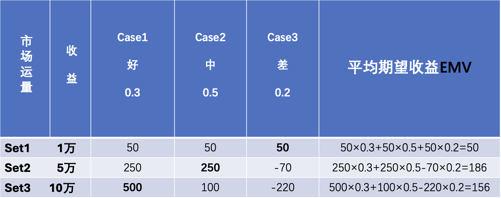

# 第一次作业

> 淘宝“女王节”，某电商计划同往年一样销售某品牌的化妆品。依据往年实际销量情况，若销路好，可按预期价格卖出10万套；若销路一般，尚可卖出5万套；但若销路差，则只能卖出1万套了。已知正常情况下每卖出一套可赚50元，但如果进货过量，则多余部分只好降价转手处理，每套反而要亏损30元。以往销路情况统计概率为：好为30%，中为50%，差为20%。为了获得最大利润，公司准备花钱先进行一下市场调查，以便尽可能摸清市场行情按需组织货源，那么问题来了：最多花费多少是值得的？

**解：**

若不进行调查：

显然，进 5w 套期望利润最高，为 186 万元。

三种市场条件下，最高的利润分别为  $500\quad 250\quad 50$ 万元

在全情报的情况下，最高期望为 $500\times 0.3 + 250\times 0.5+50\times 0.2 = 285$ 万元

因此，认为最高花费 $285 - 186 = 99$ 万元是值得的 

**评价：**该题假设市场的需求是离散的，即只有10w、5w、1w这几个值。这种假设不符合实际，使得最终的结论不具有足够的参考意义。
