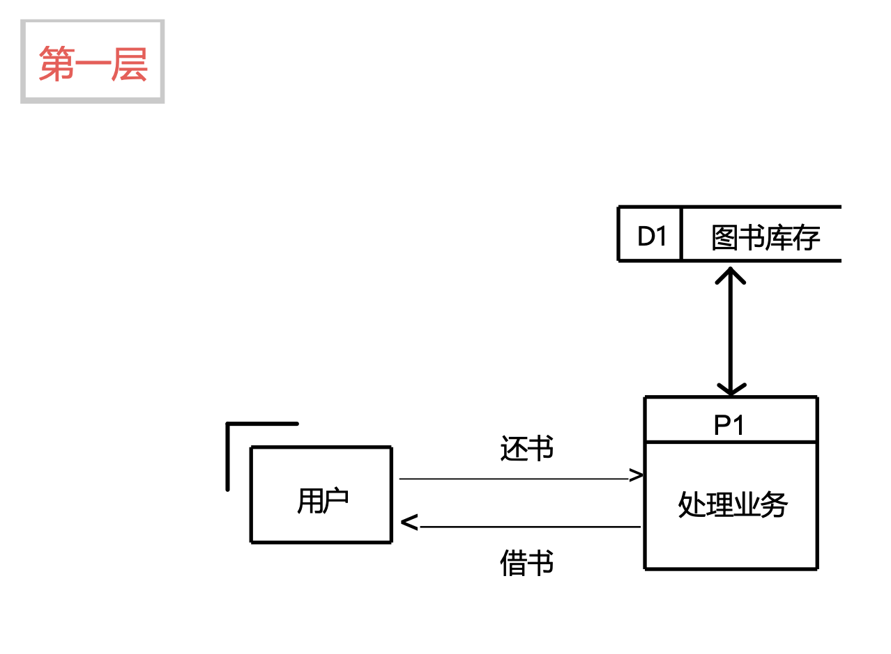
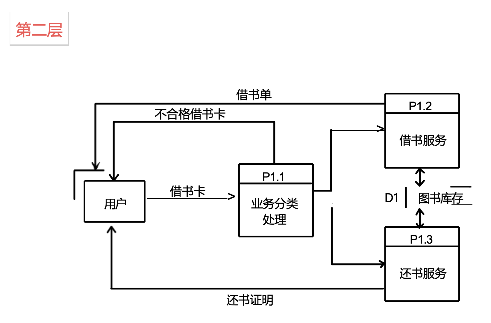
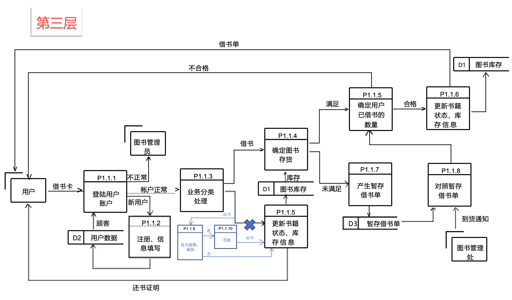

# 作业一

## 小组情况

组号：第三小组

| 姓名 |  王翼翔  |   谭涵   |  伍洛欧  |   吴樱   |  杨宇轩  |  张蕴泽  |  李可馨  |
| :--: | :------: | :------: | :------: | :------: | :------: | :------: | :------: |
| 学号 | 20200581 | 20214322 | 20215847 | 20211976 | 20212556 | 20210796 | 20205545 |

> 画出图书馆借还书服务系统概要性的系统流程图。

## 解

## 分工

|   分工   |  人员  | 贡献权重 |
| :------: | :----: | :------: |
|   作图   | 伍洛欧 |   0.2    |
| 细节补充 | 张蕴泽 |   0.1    |
|   其他   |  全体  |  各0.1   |

本次作业较为困难，在最终的评分中权重为 2。
