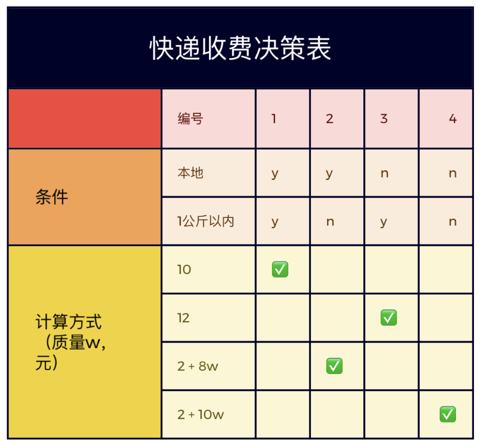

# 作业一

## 小组情况

组号：第三小组

| 姓名 |  王翼翔  |   谭涵   |  伍洛欧  |   吴樱   |  杨宇轩  |  张蕴泽  |  李可馨  |
| :--: | :------: | :------: | :------: | :------: | :------: | :------: | :------: |
| 学号 | 20200581 | 20214322 | 20215847 | 20211976 | 20212556 | 20210796 | 20205545 |

> 快递服务费判定表

## 判断树

## 判断表

## 说明

判断表又称决策表（Decision Table），是用表格方式来描述处理逻辑的一种工具，适用于条件复杂且相应决策较多，用判断树表示比较烦琐、模糊时的情况。判断表可在复杂情况下较直观、清晰地表达条件、规则和对应行动之间的逻辑关系。判断表一般可由四部分构成：即条件说明、行动说明、条件组合说明和各条件下相应的行动。表中“Y”表示条件满足，“N”表示条件不满足；“√”或“×”表示对应采取的行动。

在该快递公司包裹快递服务收费的判定表中，其四部分为：

1. 条件说明：即判定表中对应的条件。

   - 目的地的标准：本地和外地，二者选其一选择本地。

   - 重量的标准：首重（一公斤以内部分重量）和超重（大于一公斤部分重量），二者选其一选择首重（一公斤以内部分重量）。

2. 行动说明：即判定表中对应的措施。

  措施即实行的计价标准：一共四种：本地首重：10元，本地超重：10+超重部分每kg8元，外地首重：12元，外地超重：10+超重部分每kg10元。

3. 条件组合说明：即判断表中条件的满足情况。

  由行动说明可以直接得出一共有四种：本地Y首重Y，本地Y首重N，本地N首重Y，本地N首重N。

4. 各条件下相应的行动：即判定表中措施的实施情况。

  由条件组合说明的对应可知：本地Y首重Y→10元（√），本地Y首重N→10+超重部分每kg8元（√），本地N首重Y→12元（√），本地N首重N→12+超重部分每kg10元（√）。

## 分工

|  分工  |  人员  | 贡献权重 |
| :----: | :----: | :------: |
| 决策树 | 伍洛欧 |   0.12   |
| 决策表 | 王翼翔 |   0.12   |
|  说明  |  谭涵  |   0.06   |
|  其他  |  全体  |  各0.1   |

本次作业难度相对中等，在最终的评分中权重为 1.5。其他同学则在下次作业中担任主力。
